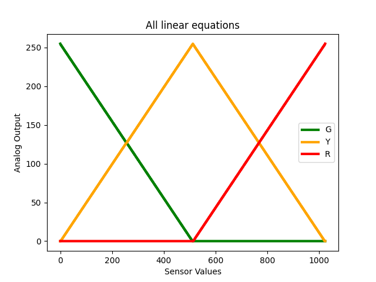
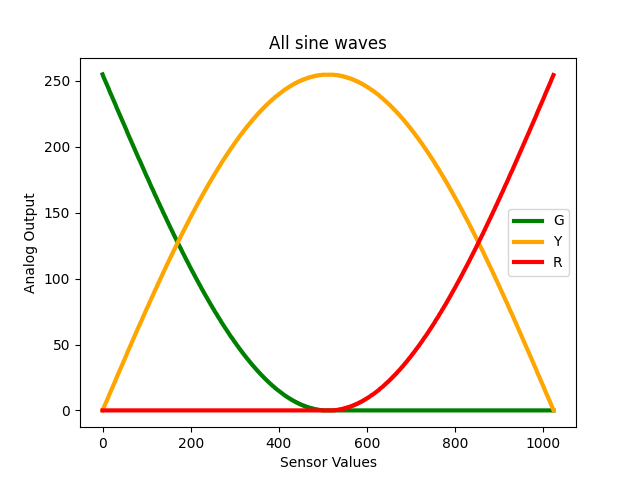

# Remarks on the included code
## ToggleButton and ToggleButton2
Usually we want code to be readable. Sometimes we make it less readable to meet constraints. 

These 2 sketches toggle a switch state between on and off. Each click will change the state. 
Both sketches are almost identical. 

To toggle the switch state, `ToggleButton` uses this terse code
```
  if (button_value == LOW ) {            // check if the input is HIGH
    is_turned_on = !is_turned_on; 
    digitalWrite(ledPin, is_turned_on);
  }
```
`ToggleButton2`	uses the following code, which appears to be more readable
```
  if (button_value == LOW ) {            // check if the input is HIGH
    if (is_turned_on) { 
      is_turned_on = false ;
    } else {
      is_turned_on = true ;
    }
    if (is_turned_on) {
      digitalWrite(ledPin, HIGH);  // turn LED ON
    } else {
      digitalWrite(ledPin, LOW);   // turn LED OFF
    }
  }
```
There is a small difference is in the program size after compilation. The terse program uses 30 bytes less. This is not important in our case, but sometimes it will be critical. 

`ToggleButton`: Sketch uses 1128 bytes (3%) of program storage space. Maximum is 30720 bytes. 

`ToggleButton2`: Sketch uses 1158 bytes (3%) of program storage space. Maximum is 30720 bytes. 


## Traffic Lights fade 

All graphs are generated in Python (see `/common/python` ).

Fading is best achieved by applying monothonic increasing or decreasing functions (פונקציות עולות ויורדות) in relevant ranges. 

First let's check out linear equations. 



But there are other options, like sine waves, inverted absolute, and even paraboles. 




### FUN with FUNctions
Functions can be manipulated in several ways. 
* Inverting a function: multiply by -1
* Offset by c on X axis: f(x+c)
* Offset by c on Y axis: f(x) + c
* Flatten or expand value by c factor: c*f(x)